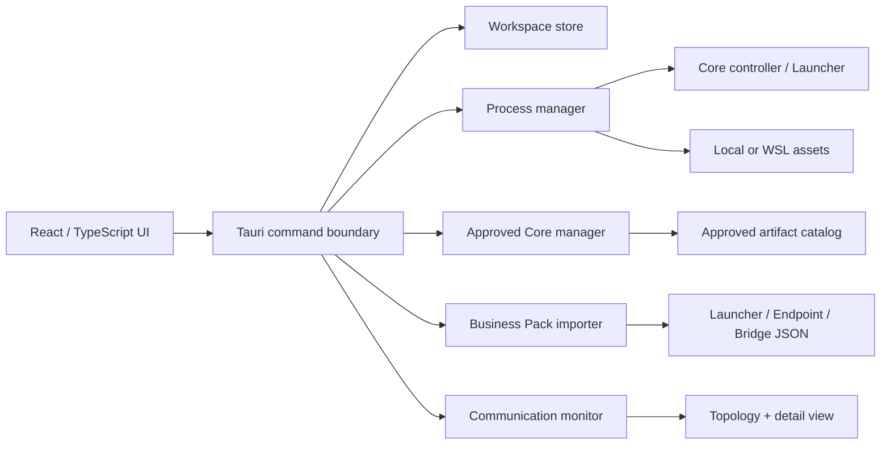

# アーキテクチャと監視モデル

## 設計原則

Hakoniwa Desktop Managerは、次の三つを別の状態機械として扱います。

| 層 | 管理対象 | 代表的な状態 | 誤って同一視してはいけないもの |
| --- | --- | --- | --- |
| **OSプロセス層** | Coreコントローラー、アセット、Bridge、Launcher | Starting、Running、Stopping、Exited、Failed | プロセスがRunningであることは、シミュレーション時間や通信を保証しません。 |
| **Hakoniwaライフサイクル層** | `hako-cmd`によるシミュレーション時刻 | start、stop、resetの実行結果 | `hako-cmd stop`は、LauncherやアセットのOSプロセスを必ずしも終了させません。 |
| **通信観測層** | PDU、Endpoint、Bridge、RPC、ネットワーク経路 | Connected、Idle、Disconnected、Unknown | 設定上の接続定義は、実際のデータフローの証明ではありません。 |

Hakoniwa Core Proでは、アセットが登録・PDUチャネル定義を行った後、`hako-cmd start`によりシミュレーションがRunnable状態へ移行します。[1] このため、画面でも「Coreを起動」と「時刻を開始」を別ボタン・別ステータスで表現します。

## ローカル実行の安全境界

Rustバックエンドのみがプロセス生成、ファイル操作、カタログ取得、アーカイブ展開を実行します。画面から渡されるアセット定義は、プログラム、引数配列、作業ディレクトリ、環境変数、実行対象として構造化され、シェル展開を行いません。

WindowsからWSL2を使う場合は、`wsl.exe -d <distribution> --cd <cwd> -- env KEY=VALUE <program> <args...>`という引数配列を構築します。これにより、PowerShell／bashの文字列クォート差異をUIコードへ持ち込まず、実行対象のディストリビューションを明示します。

| 操作 | 実装上の保護 |
| --- | --- |
| Core取得 | HTTPS必須、承認カタログに登録されたプラットフォーム／CPUのみ、SHA-256必須。 |
| ZIP展開 | 絶対パス、`..`、platform prefixを拒否し、zip-slipを防止。 |
| Core切替 | stagingディレクトリへ展開・検証後に目的バージョンへ移動。 |
| アセット実行 | NUL文字を拒否し、プログラムと引数を分離。任意のシェル文字列を評価しない。 |
| 終了操作 | 管理下プロセスをowner ID単位で停止。Launcherを使うRecipeでは、後続版でsession fileの正常終了アダプタを優先する。 |

## 設定インポート

インポーターは、指定したディレクトリ以下のJSONを読み、次の情報を**読み取り専用**で正規化します。

| 入力 | 検出対象 | 出力 |
| --- | --- | --- |
| Launcher JSON | `assets[]`、`command`、`args`、`cwd`、`env`、`depends_on`、`activation_timing` | AssetDefinition、起動依存グラフ |
| Endpoint JSON | `name`、`cache`、`comm`、`pdu_def_path` | Endpointノード、transport、相手先、PDU定義由来 |
| Comm JSON | `protocol`／`type`、`role`、`host`／`address`／`uri`、`port` | TCP／UDP／WebSocket等の接続詳細 |
| Bridge JSON | `routes`、`bridges`、`mappings`、転送ポリシー | Bridge経路、送信元・宛先、PDU、policy |

PDUはデータモデル、Endpointは通信、Bridgeは転送制御であり、役割を分離して扱うのがHakoniwaの基本構造です。[2] そのためトポロジーでは、単なる「接続済み」だけでなく、transport、PDU名、設定由来、監視ソースを詳細ペインへ表示します。

## 通信状態の算出

通信状態は、Bridge monitor、Endpointログ、Core monitor、または手動確認イベントから得たイベント列で決定します。最新のイベントだけではなく、メッセージ／heartbeat時刻、明示的な切断／エラー、設定存在を組み合わせます。

| 状態 | 判定 | 表示上の意味 |
| --- | --- | --- |
| **Connected** | 最終message／heartbeat／connectedイベントから15秒以内 | 直近に通信または健全性通知を観測。 |
| **Idle** | 最終活動から15秒超、120秒以内 | 経路は観測済みだが、現在はデータが流れていない可能性。正常な待機状態を含む。 |
| **Disconnected** | 最終活動から120秒超、または切断／エラーイベント | 接続が失われたか、通信がタイムアウト。詳細に最後のエラーを表示。 |
| **Unknown** | 静的設定だけで、対応monitorやイベントがない | 構成は分かるが、実通信は確認できていない。 |

> **重要**：共有メモリPDU通信は、TCPソケット監視だけからは判定できません。Core Proが提供するデータ受信イベント、または外部SHMクライアントとして実装するread-only monitorを用い、PDUチャネルの書込み・受信を観測する必要があります。[1]

## 遠隔アセットの境界

EndpointはTCP、UDP、WebSocket、Zenoh、MQTT、SHMなどのtransportを設定で切り替えられます。[3] アプリはEndpoint／Bridge設定に含まれる遠隔経路を描画し、対応するmonitorイベントがあれば通信状態を更新します。

ただし、アプリが遠隔ホストの任意プロセス、任意ソケット、任意共有メモリを勝手に読取・制御することはしません。リモート側がEndpoint、Bridge、RPC、または明示的なテレメトリを提供しない場合は、UIは「Unknown」または「到達性のみ確認可能」と表示します。

## 拡張点

1. **Core Pro monitor adapter**：外部クライアントとしてPDU受信イベントを登録し、PDU名・方向・件数・最終活動だけをイベント化します。
2. **Launcher session adapter**：`hakoniwa-pdu` 1.6.5以降のsession file lifecycleを検出し、PID強制終了より正常な`terminate`を優先します。[4]
3. **Bridge monitor adapter**：Bridge Coreのhealth、connections、list_pdus、tailを構造化して収集します。[5]
4. **Remote agent**：端末間にread-only telemetryエージェントを配置し、アプリの経路観測を拡張します。これは明示的な導入と認証を要する後続機能です。

## 参照

[1]: https://github.com/hakoniwalab/hakoniwa-core-pro "hakoniwa-core-pro README"
[2]: https://github.com/ykikuchii/hakoniwa-business-pack/blob/main/docs/hakoniwa-base-ecosystem-ja.md "Hakoniwa Base Ecosystem Guide"
[3]: https://github.com/hakoniwalab/hakoniwa-pdu-endpoint "hakoniwa-pdu-endpoint README"
[4]: https://github.com/hakoniwalab/hakoniwa-business-pack/blob/main/docs/hakoniwa-runtime-primer.md "Hakoniwa Runtime Primer"
[5]: https://github.com/ykikuchii/hakoniwa-business-pack/blob/main/catalog/components/hakoniwa-pdu-bridge-core.yaml "PDU Bridge Core catalog"
